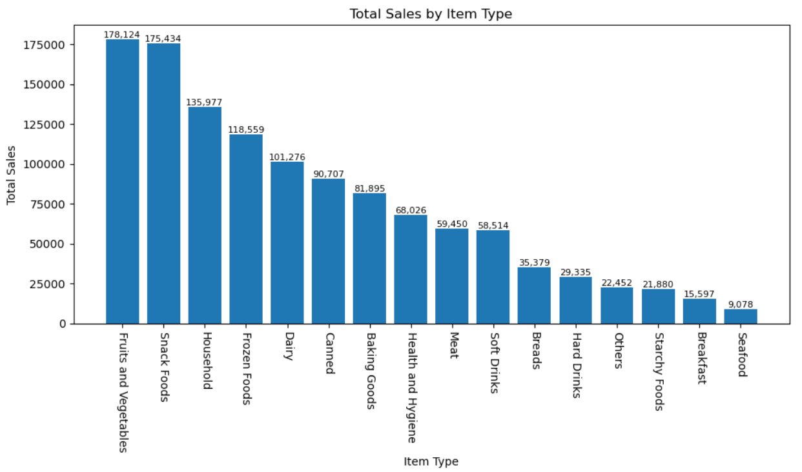
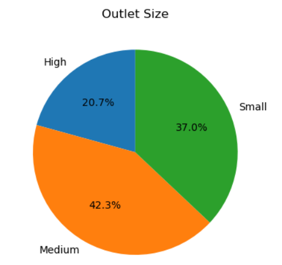
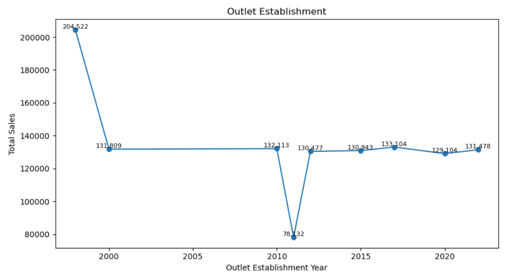
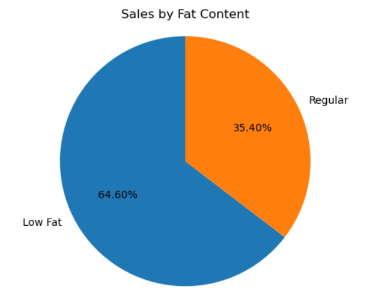

# 🛒 Blinkit Sales Analysis Using Python


## 📌 Project Overview

This project presents a comprehensive sales performance analysis of **Blinkit**, focusing on revenue trends, product category performance, outlet distribution, and customer satisfaction metrics.

Using Python-based Exploratory Data Analysis (EDA), the project evaluates key retail KPIs and uncovers actionable business insights to support strategic decision-making.

## 🎯 Business Objectives

Analyze overall sales performance across outlets

Identify high-performing product categories

Evaluate impact of fat content on total revenue

Compare sales distribution by outlet size and location

Assess influence of outlet establishment year on performance

Deliver data-driven retail optimization insights

## 📊 Key KPIs Analyzed

Total Sales – Overall revenue generated

Average Sales – Average revenue per transaction

Number of Items Sold – Total count of items purchased

Average Rating – Customer satisfaction indicator

## 📈 Visual Analysis & Insights
## 🥇 Total Sales by Item Type
<p align="center">  </p>

**Insight:**
Certain product categories dominate overall revenue contribution, highlighting priority segments for inventory planning and promotional strategies.

## 🏬 Sales by Outlet Size
<p align="center">  </p>

**Insight:**
Medium-sized outlets generate optimal sales performance, indicating balanced operational efficiency and demand capacity.

## 📅 Sales Trend by Outlet Establishment Year
<p align="center">  </p>

**Insight:**
Established outlets demonstrate more stable revenue patterns, while newer outlets show gradual growth potential.

## 🥗 Total Sales by Fat Content
<p align="center">  </p>

**Insight:**
Product segmentation by fat content reveals significant variation in revenue contribution, supporting targeted merchandising decisions.

## 🛠 Tools & Technologies Used

Python

Pandas – Data cleaning & transformation

NumPy – Numerical computations

Matplotlib & Seaborn – Data visualization

Jupyter Notebook – Analysis environment

## 📂 Repository Structure
```
Blinkit-Sales-Analysis-Python/
│
├── data/
│   └── blinkit_data.csv
│
├── notebooks/
│   └── Blinkit_Analysis.ipynb
│
├── images/
│   ├── sales_by_item_type.png
│   ├── sales_by_outlet_size.png
│   ├── sales_trend_by_establishment.png
│   └── sales_by_fat_content.png
│
├── requirements.txt
└── README.md
```
## 📊 Dataset Overview

The dataset includes the following attributes:

Item Type

Fat Content

Outlet Size

Outlet Location

Outlet Establishment Year

Sales

Customer Rating

## 🚀 Project Outcomes

Demonstrated strong Exploratory Data Analysis (EDA) capabilities

Transformed raw retail data into structured business insights

Identified revenue concentration areas and performance drivers

Built professional visual storytelling for decision support

## 👤 Author

Manikantan P
Business Analyst | Data Analytics | Python | SQL | Power BI | Tableau
